```{r,workplace, message=FALSE, warning=FALSE, results='hide', echo=FALSE}
knitr::opts_chunk$set(message = FALSE)
knitr::opts_chunk$set(warning = FALSE)
library(Seurat)
# library(plotly)
#install.packages("future")
# library(future)
library(dplyr)
library(ggplot2)
library(cowplot)
# library(gridExtra)
# library(ggrepel)
library(ggrepel)


#setwd("scripts")
```

######## Objective:

* Clustering and annotation of 10X homeo isl1 sibling data

* Integration with smartseq2 data, with 2 replicates, and 2 treatments: homeo and 1hr


# Results {.tabset .tabset-pills}

## Week of April 6th {.tabset}
We will discuss results here

######## Create Seurat Object for 10X homeo data, preprocesssing, QC filtering

```nFeature_RNA``` is the number of genes detected in each cell. 

```nCount_RNA``` is the total number of molecules detected within a cell. 

Low ```nFeature_RNA``` for a cell indicates that it may be dead/dying or an empty droplet. 

High ```nCount_RNA``` and/or ```nFeature_RNA``` indicates that the "cell" may in fact be a doublet (or multiplet). 

```{r,fig.height=25, eval=FALSE}
nFeature.vln.homeo.isl1.sib.10X + nCount.vln.homeo.isl1.sib.10X + pct.mito.vln.homeo.isl1.sib.10X
```

```{r, fig.width = 10,eval=FALSE}
featurescatter.nCountXpercent.mt.homeo.isl1.sib.10X + featurescatter.nCountXnFeature.homeo.isl1.sib.10X
```

Filter cutoff: 
#subsetting parameters: omit cells with genes less than 3000 and greater than 200. omit mitochondrial contamination greater than 10%. omit cells with molecules greater than 10,000

Noticable increase in cells/samples from 2979 to ~16000 using an alternative subsetting parameter:
```homeo.isl1_sib_10X <- subset(homeo.isl1_sib_10X, subset = nFeature_RNA > 200 & nFeature_RNA < 3000 & percent.mt < 10 & nCount_RNA <10000)```

```homeo.isl1_sib_10X <- subset(homeo.isl1_sib_10X, subset = nFeature_RNA > 200 & nFeature_RNA < 3000 & percent.mt < 10)```
will give 2979 cells, which is way to conservative, marker genes will not be expressed with this subset

```{r,eval=FALSE}
homeo.isl1_sib_10X
```

**Find Variable Features**

```{r,eval=FALSE}
VariableFeature.labedlplot2.homeo.isl1_sib_10X
```

Error in getGlobalsAndPackages(expr, envir = envir, globals = globals) : 
  The total size of the 11 globals that need to be exported for the future expression (‘FUN()’) is 3.18 GiB. This exceeds the maximum allowed size of 0.98 GiB (option 'future.globals.maxSize'). The three largest globals are ‘object’ (3.17 GiB of class ‘numeric’), ‘features’ (1.67 MiB of class ‘character’) and ‘split.cells’ (1.39 MiB of class ‘list’).
  
  Formerally using set future.global to 1G, change to 3.5G however activit usage on local mac is using 6G/8G. If R session aborts, will have to resort to "sequential" and fargo parallelization.
  
  Parallelization seems to force abort R session, switch to sequential process from now on.
  
## Choosing PC

```{r,scree,eval=FALSE}
ElbowPlot(homeo.isl1_sib_10X, ndims = 50)

ElbowPlot(homeo.isl1_sib_10X, ndims = 30)

ElbowPlot(homeo.isl1_sib_10X, ndims = 20)

```

Scree plot shows that variance/eigenvalues in data seem to level off between 15-20 PCs. We'll get the most information within the first ~15 PCs. Use jackstraw to confirm statistical power.

```{r,eval=FALSE}
JackStrawPlot.PC20.homeo.isl1_sib_10X
```

Showing less statistical significance past >18 PC. Will set PC to 15

PC 15 with resolution 1.2, 14 clusters: gave pretty neat cluster, some single cells outside their prespective groupings however no striking outliers

```{r,eval=FALSE}
umap.unlabeled
```

24 Clusters generated

######## Annotation

List of marker genes was taken from Lush (2019) publications

Functions created to help annotate and visualize marker genes:

########FeaturePlotToPNG########
Given list of marker genes, will print individual FeaturePlot and directs the plots to the specified directory

```figure_dir <- "isl1_sib_counts_10X_figures"
FeaturePlotToPng <- function(marker.list, dir_name) {
  for (x in marker.list){
    #to.png <- FeaturePlot(homeo.isl1_sib_10X, features = x, label = TRUE) 
    print(x)
    mypath <- file.path("./", figure_dir, paste(x, ".png", sep = ""))
    print(mypath)
    png(file=mypath,width = 11, height = 9, units = 'in', res = 300)
    print(FeaturePlot(homeo.isl1_sib_10X, features = x, label = TRUE) )
    dev.off()}}```


########VlnPlotToPNG
Given list of marker genes, will print individual Vlnplot and directs the plots to the specified directory


```
VlnPlotToPng <- function(marker.list, dir_name) {
  for (x in marker.list){
    #to.png <- FeaturePlot(homeo.isl1_sib_10X, features = x, label = TRUE) 
    print(x)
    mypath <- file.path("./", figure_dir, paste(x, "_vlnplot.png", sep = ""))
    print(mypath)
    
    png(file=mypath,width = 11, height = 9, units = 'in', res = 300)
    print(VlnPlot(homeo.isl1_sib_10X, features = x, , pt.size = 0))
    dev.off()
  }
}
```


#########Top10GeneCellIdentityFunction#########
This function will return a adjusted dataframe for the genes with the 10 (or less) highest avg_logFC and its corresponding cluster it will also generate a FeaturePlot and Violin Plot corresponding
this function may be helpful as most canonical markers have low signal, this will discern what signal is highest to help identify clusters


```
Top10GeneCellIdentity <- function(marker.list, df){
  #This function will return a adjusted dataframe for the genes with the 10 (or less) highest avg_logFC
  #and its corresponding cluster
  #it will also generate a FeaturePlot and Violin Plot corresponding
  #this function may be helpful as most canonical markers have low signal, this will discern what signal is highest to help identify clusters
  top10.df <-filter(df, Gene.name.uniq == marker.list) %>% top_n(n = 10, wt = (avg_logFC)) %>% arrange(desc(avg_logFC))
  gene.list <- unique(top10.df$Gene.name.uniq)
  feature.plot <- FeaturePlot(homeo.isl1_sib_10X, features = gene.list, label = TRUE)
  vln.plt <- VlnPlot(homeo.isl1_sib_10X, features = gene.list, pt.size = 0)
  return(list(top10.df, feature.plot, vln.plt))
  dev.off()
}
```

**More Robust Marker Gene**

Use excel sheet for Lush (2019) suppl file 9 for list of hair cells in their young, mature, prog stages


################ Renamed Cluster Identity


Note: Tiny clusters with -pos suffix indicate markers that have a high expression for that cluster.

Use command line to search for the top 20-200 genes within that cluster to determine identity name. Although it may not be the first highly express, search for common gene, see mfap-pos cluster for example

```filter(all.markers.homeo.isl1_sib_10X, cluster == x) %>% top_n(n = 20, wt = (avg_logFC)) %>% arrange(desc(avg_logFC))```


## Week April 13th

* import smartseq2 data matrix

* convert ensembl gene id into gene symbol

* create treatment column in smartseq2 metadata

* split smartseq 2 data into its respective treatment groups

* integrate smartseq2 with 10X data using standard workflow

* alternatively, use SC transform method to integrate


Reoccuring error message:
```Error: Feature names of counts matrix cannot be empty```

1st method:
load in seurat object with ensembl id and convert object[["RNA]]@counts to gene symbol manually however the error message will appear in ```IntegrateData()```

2nd method:
convert 10X homeo data to ensembl ID to match smartseq2 rownames
error message:
```Error: vector memory exhausted (limit reached?)``` 
due to large memory size of 10X homeo data 

attemped resolution:
Step 1: Open terminal,

Step 2:

cd ~
touch .Renviron
open .Renviron
Step 3: Save the following as the first line of .Renviron:

R_MAX_VSIZE=8Gb

to increase RAM capacity on local computer

resolution:
create a job on talapas virtual desktop

checking for empty cell in rownames(fpkm_matrix)
#check if rownames is empty
```which(rownames(x = fpkm_expression_mtx) == '')```
#[1] 11478
```print(rownames(fpkm_expression_mtx)[11478])```
#[1] ""
#delete
```new_fpkm_expression_mtx <- fpkm_expression_mtx[-11478,]```
#turn to sparse matrix
```fpkm_expression_mtx <- as.sparse(fpkm_expression_mtx)```

#check
```dim(new_fpkm_expression_mtx)```
#[1] 32488   649

```which(rownames(x = new_fpkm_expression_mtx) == '')```
#integer(0)

error resolved, can proceed with integration

**fpkm smartseq umap**


Note:

* ```FindVariableFeatures()``` and ```NormalizeData()``` is performed on the integrated object list, not on the original seurat object itself


**Integration of data**

```Integrating data|++++++++++++++++++++++++++++++++++++++++++++++++++| 100% elapsed=57s  Warning: Adding a command log without an assay associated with it```

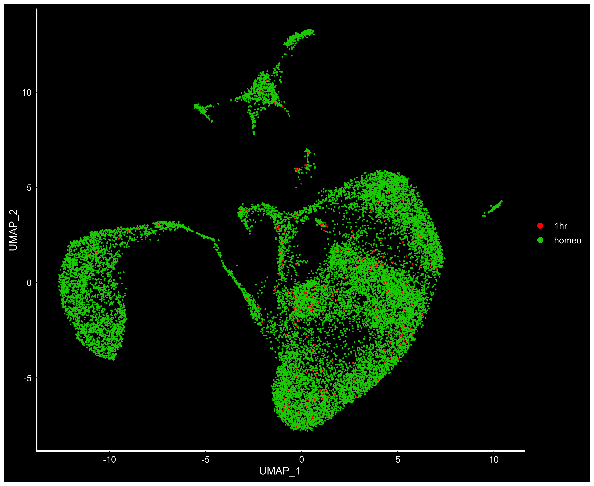


Sost and wnt2 is still weakly defining the DV Pole


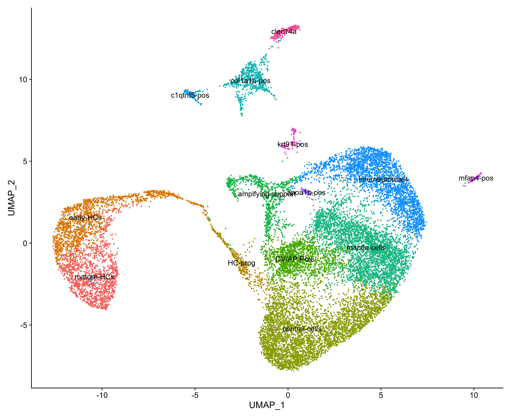


```
Warning: Could not find myclb in the default search locations, found in RNA assay instead
Warning: Could not find pcdh18b in the default search locations, found in RNA assay instead
Warning: Could not find dla in the default search locations, found in RNA assay instead
Warning: Could not find tox in the default search locations, found in RNA assay instead
Warning: Could not find mcama in the default search locations, found in RNA assay instead
Warning: Could not find sfrp1a in the default search locations, found in RNA assay instead
Warning: Could not find isl1 in the default search locations, found in RNA assay instead
Warning: Could not find slc1a3a in the default search locations, found in RNA assay instead
Warning: Could not find lfng in the default search locations, found in RNA assay instead
Warning: Could not find ebf3a in the default search locations, found in RNA assay instead
Warning: Could not find spaca4l in the default search locations, found in RNA assay instead
```


Resolved by implementing the following:
```all_shared_genes <- lapply(seurat_obj_list, row.names) %>% Reduce(intersect, .) ```

## Week of April 20: Differential Gene Expression

* Differential Gene Expression of Central Cells: 1hr vs Homeo

**Top 10 Differentially Expressed Genes in Central cells at 1hr Vs. Homeo**

```{r, eval=FALSE}
kable(head(read.table(file = '../data/central.dge.df.tsv', sep = '\t', header = T),10))
```


######## Weekly Meeting To-Do List April 22:

* provide metrics on the differences UMI abundance/ features:cell abundance between 10X and smartseq

* provide DGE of more than 10 genes, note that sequencing depth differs between smartseq and 10X

* integration of more homeostatsis data on stowers file

* try vars.to.regress on homeo 10X to see if a more robust DV cluster is present

* look at subpopulation of HC


######## Cell Ranger

three homeo samples are located in the following dir after logging on to Stowers Portal

```Index of /n/analysis/Piotrowski/sb2191/MOLNG-2410/HK3H3BCX2/HK3H3BCX2``` within the ```webfs``` link

```/n/analysis/Piotrowski/sb2191/MOLNG-2410/HK3H3BCX2/HK3H3BCX2/L34727```

```/n/analysis/Piotrowski/sb2191/MOLNG-2410/HK3H3BCX2/HK3H3BCX2/L34728```

```/n/analysis/Piotrowski/heb/MOLNG-2047/HLC2NBCXY/L29314```


installing wget to download .fq files from stowers portal


```503   brew install wget
  504  sudo chown -R $(whoami) /usr/local/lib/pkgconfig /usr/local/share/man/man3 /usr/local/share/man/man5
  505  chmod u+w /usr/local/lib/pkgconfig /usr/local/share/man/man3 /usr/local/share/man/man5
  506   brew install wget```


**original script**


```#!/bin/bash
#SBATCH --account=bgmp
#SBATCH --partition=bgmp
#SBATCH --time=0-15:00:00
#SBATCH --nodes=1
#SBATCH --ntasks-per-node=1
#SBATCH --cpus-per-task=16
#SBATCH --job-name=CR_L34727      ### Job Name
#SBATCH --output=CR_L34727.out         ### File in which to store job output
#SBATCH --error=CR_L34727.err          ### File in which to store job error messages

conda activate bgmp_py3

module purge
ml cellranger/3.0.2

/usr/bin/time -v cellranger count --id=homeo \
--transcriptome=/projects/bgmp/ntran2/SIMR_2019/cellranger/refdata-cellranger-GRCh38-3.0.0 \
--fastqs=/home/ntran2/bgmp/SIMR_2019/cellranger/L34727/ \
--sample=L34727 \
--localmem=200```


Error in .out file:


```Checking reference_path (/projects/bgmp/ntran2/SIMR_2019/cellranger/ens98_danRer11_cellranger-2.1.0/) on n225...

[error] Your reference does not contain the expected files, or they are not readable. Please check your reference folder on n225.```


This may be due to a version clash. Talapas uses cellranger/3.0.2, reference directory shows as ```ens98_danRer11_cellranger-2.1.0```

Solution: create a custom ens98 reference genome using ```mkref```

opt for Danio_rerio.GRCz11.98.gtf as reference gft because it has more lines compared to Danio_rerio.GRCz11.98.chr.gtf (as noted by Daniel)


Error Msg:

```[ntran2@talapas-ln1 chnk1-u7ca7a31ba9]$ cat _stdout 
[stdout]
chunk_reads vVERSION
chunks: [("R1", "/home/ntran2/bgmp/SIMR_2019/mkref_core_bio_gft/L34727/L34727_S1_L002_R1_001.fastq.gz", false), ("R2", "/home/ntran2/bgmp/SIMR_2019/mkref_core_bio_gft/L34727/L34727_S1_L002_R2_001.fastq.gz", false), ("I1", "/home/ntran2/bgmp/SIMR_2019/mkref_core_bio_gft/L34727/L34727_S1_L002_I1_001.fastq.gz", false)]
opening: "/home/ntran2/bgmp/SIMR_2019/mkref_core_bio_gft/L34727/L34727_S1_L002_R1_001.fastq.gz"
opening: "/home/ntran2/bgmp/SIMR_2019/mkref_core_bio_gft/L34727/L34727_S1_L002_R2_001.fastq.gz"
got recs: 71461905
opening: "/home/ntran2/bgmp/SIMR_2019/mkref_core_bio_gft/L34727/L34727_S1_L002_I1_001.fastq.gz"
got recs: 24634212
got recs: 71461905
error: corrupt gzip stream does not have a matching checksum
caused by: corrupt gzip stream does not have a matching checksum
------------
If you believe this is a bug in chunk_reads, please report a bug to support@10xgenomics.com.

running chunk reads: [['chunk_reads', '--reads-per-fastq', '5000000', '/home/ntran2/bgmp/SIMR_2019/mkref_core_bio_gft/homeo/SC_RNA_COUNTER_CS/SC_RNA_COUNTER/_BASIC_SC_RNA_COUNTER/CHUNK_READS/fork0/chnk1-u7ca7a31ba9/files/', 'fastq_chunk', '--martian-args', 'chunk_args.json', '--compress', 'lz4']]```

Conclusion:
corrupt or incomplete FASTQ files are a common cause for pipeline failure in this  cellranger count stage.

Corrupt or incomplete FASTQ files typically result from incomplete transfers. To verify that files are identical between source and destination, please use file checksums such as md5sum

Fastq L34727_S1_L002_I1_001.fastq.gz does not match L34727_S1_L002_R1_001.fastq.gz and L34727_S1_L002_R2_001.fastq.gz

Sample L34727 outputted the same error message

runtime ~ 2 mins before erroring out

use ```md5sum``` for linux on talapas, use ```md5``` on Mac OS

On talapas:

```[ntran2@talapas-ln1 L34727]$ md5sum  L34727_S1_L00*
95082022948de7d34fa6c9a83944ac96  L34727_S1_L001_I1_001.fastq.gz
c46fc567761a314ed1d48433a695ff35  L34727_S1_L001_R1_001.fastq.gz
17a74db49a6870cb408fae734411b141  L34727_S1_L001_R2_001.fastq.gz
38ff6d902efe0de20a0c026f5a982980  L34727_S1_L002_I1_001.fastq.gz
44eaa0eb531740ce221db30b5f57ec0d  L34727_S1_L002_R1_001.fastq.gz
7b32c844eb5663947c31a4a6149755f4  L34727_S1_L002_R2_001.fastq.gz```

On local, MacOS:

```(base) Giois-MacBook-Pro:L34727 GioiTran$ cat output.txt 
95082022948de7d34fa6c9a83944ac96 L34727_S1_L001_I1_001.fastq.gz
c46fc567761a314ed1d48433a695ff35 L34727_S1_L001_R1_001.fastq.gz
17a74db49a6870cb408fae734411b141 L34727_S1_L001_R2_001.fastq.gz
38ff6d902efe0de20a0c026f5a982980 L34727_S1_L002_I1_001.fastq.gz
44eaa0eb531740ce221db30b5f57ec0d L34727_S1_L002_R1_001.fastq.gz
7b32c844eb5663947c31a4a6149755f4 L34727_S1_L002_R2_001.fastq.gz```

checksum bytes scp'ed from MacOS --> Talapas HPC is the same

On Stower's portal, Maple server:

```nt2473@maple ~/SIMR_Piostrowski/cellranger/L34727$ md5sum  L34727_S1_L00*
95082022948de7d34fa6c9a83944ac96  L34727_S1_L001_I1_001.fastq.gz
c46fc567761a314ed1d48433a695ff35  L34727_S1_L001_R1_001.fastq.gz
08ca396c8e2b42c95466e8b132915ac5  L34727_S1_L001_R2_001.fastq.gz
38ff6d902efe0de20a0c026f5a982980  L34727_S1_L002_I1_001.fastq.gz
44eaa0eb531740ce221db30b5f57ec0d  L34727_S1_L002_R1_001.fastq.gz
0d72b7a6e4f646ff3d51ee8c2ec20ce4  L34727_S1_L002_R2_001.fastq.gz```

However, checksum bytes from Maple server --> local MacOS is different
```08ca396c8e2b42c95466e8b132915ac5  L34727_S1_L001_R2_001.fastq.gz``` from Stower's portal is different from ```17a74db49a6870cb408fae734411b141  L34727_S1_L001_R2_001.fastq.gz``` once downloaded onto local computer
Concludes that downloading files from Stower's portal is not as stable as logging in with ssh external access

## Week of April 27th {.tabset}

Sample L29314 pulled from ```/n/analysis/Piotrowski/heb/MOLNG-2047/HLC2NBCXY/L29314```

Sample L34728 pulled from ```/n/analysis/Piotrowski/sb2191/MOLNG-2410/HK3H3BCX2/HK3H3BCX2/L34728```

Sample L34727 pulled from ```/n/analysis/Piotrowski/sb2191/MOLNG-2410/HK3H3BCX2/HK3H3BCX2/L34727```

 On Stower's Maple Server:
 
```cd SIMR_Piostrowski/cellranger/
cp -r /n/analysis/Piotrowski/sb2191/MOLNG-2410/HK3H3BCX2/HK3H3BCX2/L34727 .
cp -r /n/data1/genomes/indexes/danRer11/annotation/Ens_98/10x/cellranger-2.1.0/ .
cellranger count --id=run_count_L34727 --transcriptome=cellranger-2.1.0/ --fastqs=L34727/ --sample=L34727
cp -r /n/analysis/Piotrowski/sb2191/MOLNG-2410/HK3H3BCX2/HK3H3BCX2/L34728 .
cellranger count --id=run_count_L34728 --transcriptome=cellranger-2.1.0/ --fastqs=L34728/ --sample=L34728
cp -r /n/analysis/Piotrowski/heb/MOLNG-2047/HLC2NBCXY/L29314 .
cellranger count --id=run_count_L29314 --transcriptome=cellranger-2.1.0/ --fastqs=L29314/ --sample=L29314```

Successful run of all three samples. Example of final log output:

```Outputs:
- Run summary HTML:                         /home/nt2473/SIMR_Piostrowski/cellranger/run_count_L29314/outs/web_summary.html
- Run summary CSV:                          /home/nt2473/SIMR_Piostrowski/cellranger/run_count_L29314/outs/metrics_summary.csv
- BAM:                                      /home/nt2473/SIMR_Piostrowski/cellranger/run_count_L29314/outs/possorted_genome_bam.bam
- BAM index:                                /home/nt2473/SIMR_Piostrowski/cellranger/run_count_L29314/outs/possorted_genome_bam.bam.bai
- Filtered feature-barcode matrices MEX:    /home/nt2473/SIMR_Piostrowski/cellranger/run_count_L29314/outs/filtered_feature_bc_matrix
- Filtered feature-barcode matrices HDF5:   /home/nt2473/SIMR_Piostrowski/cellranger/run_count_L29314/outs/filtered_feature_bc_matrix.h5
- Unfiltered feature-barcode matrices MEX:  /home/nt2473/SIMR_Piostrowski/cellranger/run_count_L29314/outs/raw_feature_bc_matrix
- Unfiltered feature-barcode matrices HDF5: /home/nt2473/SIMR_Piostrowski/cellranger/run_count_L29314/outs/raw_feature_bc_matrix.h5
- Secondary analysis output CSV:            /home/nt2473/SIMR_Piostrowski/cellranger/run_count_L29314/outs/analysis
- Per-molecule read information:            /home/nt2473/SIMR_Piostrowski/cellranger/run_count_L29314/outs/molecule_info.h5
- CRISPR-specific analysis:                 null
- Loupe Cell Browser file:                  /home/nt2473/SIMR_Piostrowski/cellranger/run_count_L29314/outs/cloupe.cloupe

2020-04-28 20:19:25 [perform] Serializing pipestance performance data.
Waiting 6 seconds for UI to do final refresh.
Pipestance completed successfully!```

 
 
 * try vars.to.regress & change subsetting parameterson homeo 10X to see if a more robust DV cluster is present
 
 **new subset parameter:**
 
 ```homeo.isl1_sib_10X <- subset(homeo.isl1_sib_10X, subset = nFeature_RNA < 3000 & percent.mt < 10 & nCount_RNA <20000)```
 
 
An object of class Seurat 
25622 features across 16741 samples within 1 assay 
Active assay: RNA (25622 features)

Roughly ~600 more cells with new assay compared to the original

**regressed nCount_RNA:**

```> homeo.isl1_sib_10X <- ScaleData(homeo.isl1_sib_10X, features = NULL, vars.to.regress = "nCount_RNA", verbose = TRUE)
Regressing out nCount_RNA
Centering and scaling data matrix```


Conclusion: despite reparameterizing to regress the UMI variation during the scaling step, we see that the DV poles are still weakly defined at each incremental PC (10-25). 

######### Assessing UMI Abundance


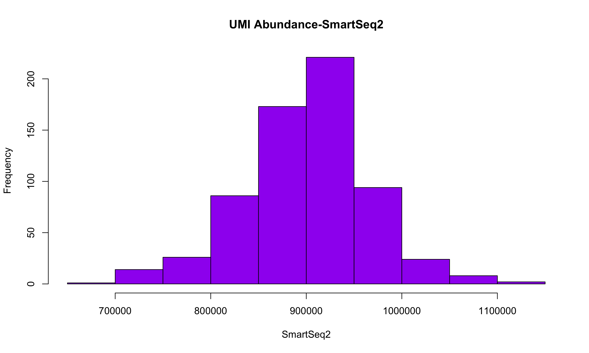

######## Setting up ssh tunnel

```{bash, eval=FALSE}
#get into .config file on local machine
nano ~/.ssh/config
Host maple
User nt2473
ProxyCommand ssh nt2473@access.stowers.org exec nc %h %p 
ssh maple

#server xi18050533 is Piostrowski's general server
# 2 Nvidia RTX 2080 Ti GPUs
#12 threads

```

## Week May 4th - Integration of Homeostatic Samples {.tabset}

#### Clustering based on datasets (PC 15, 20 ,25, 30)

 


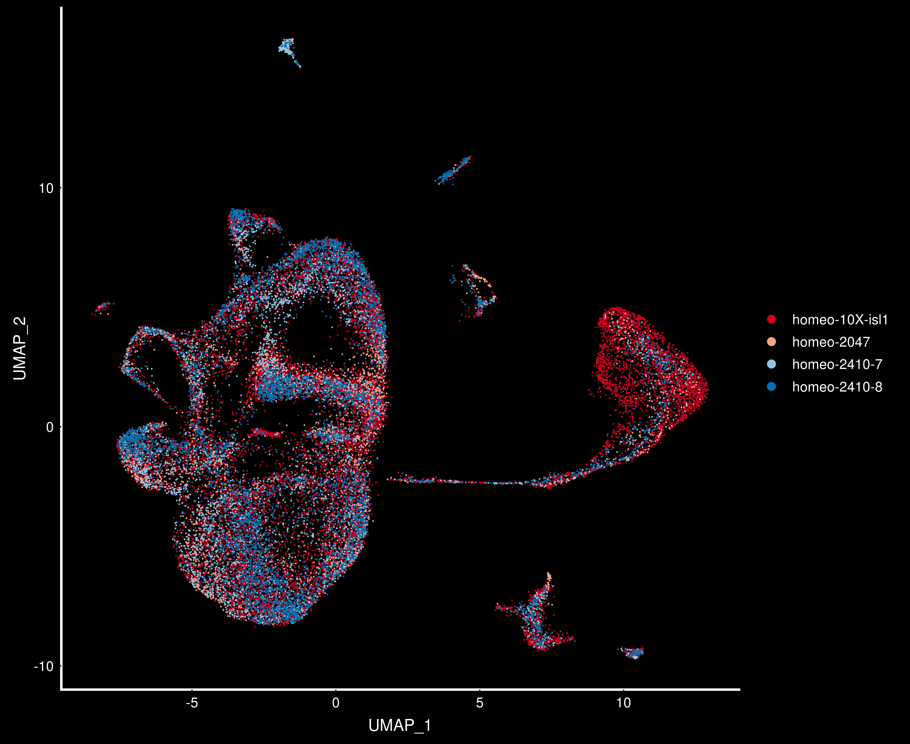

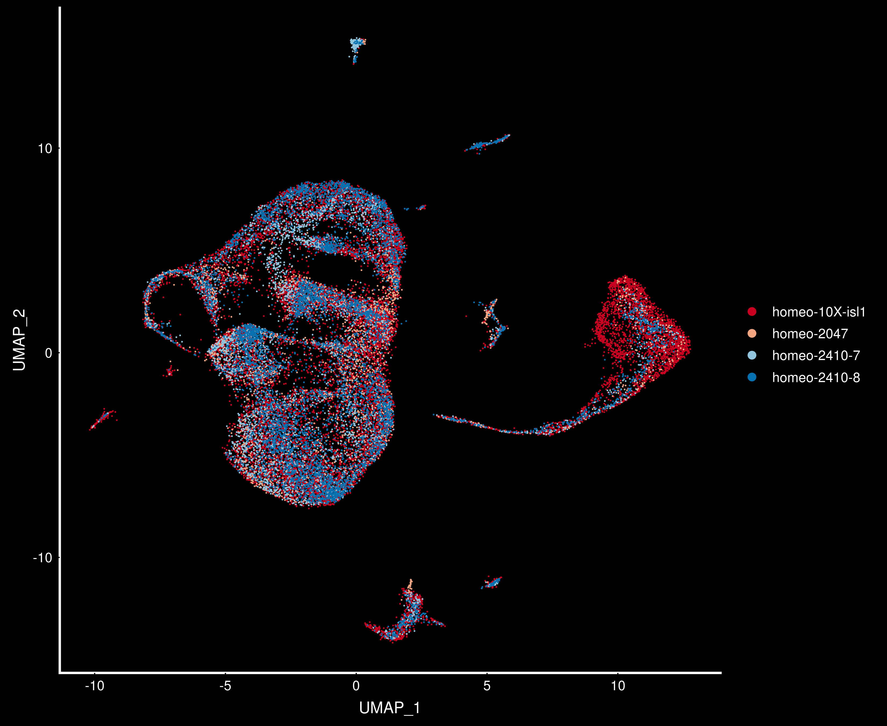

#### Unannotated Umap Clustering (PC 15, 20 ,25, 30)

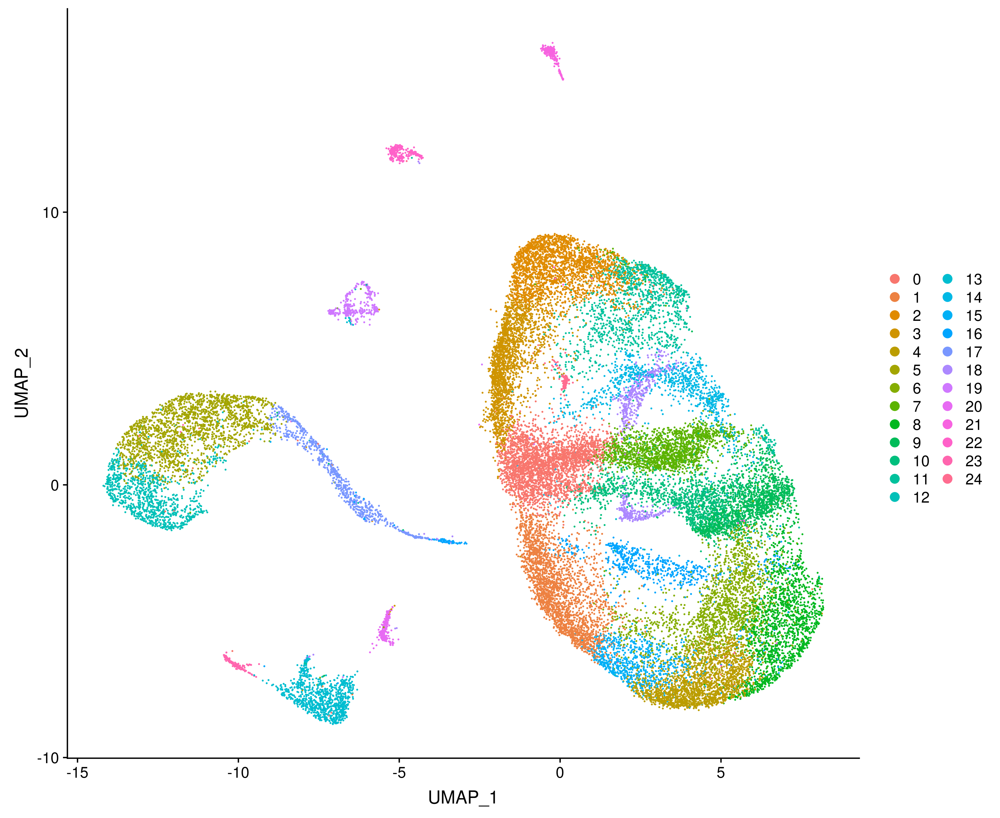 

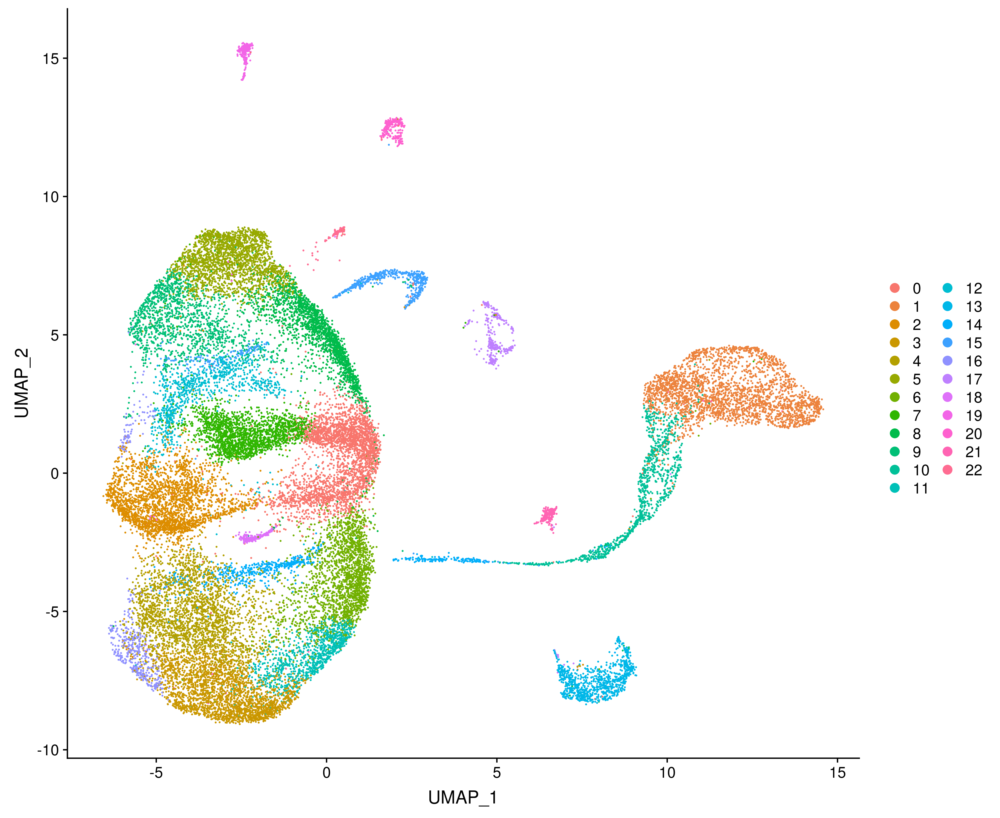

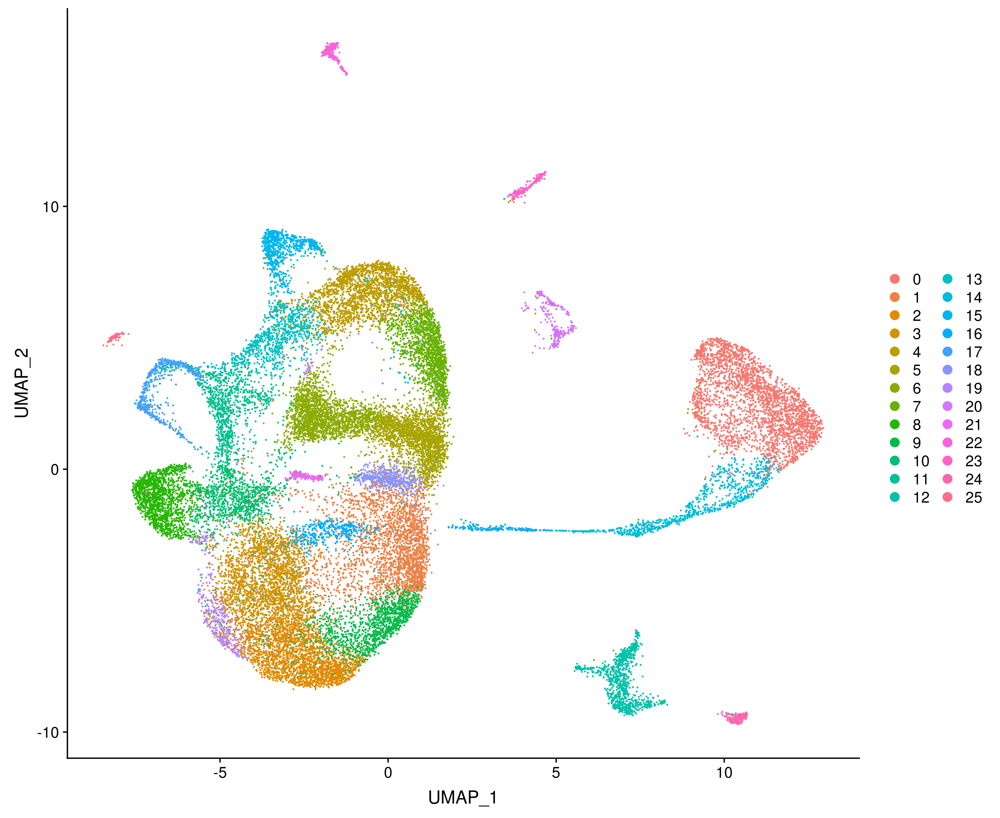

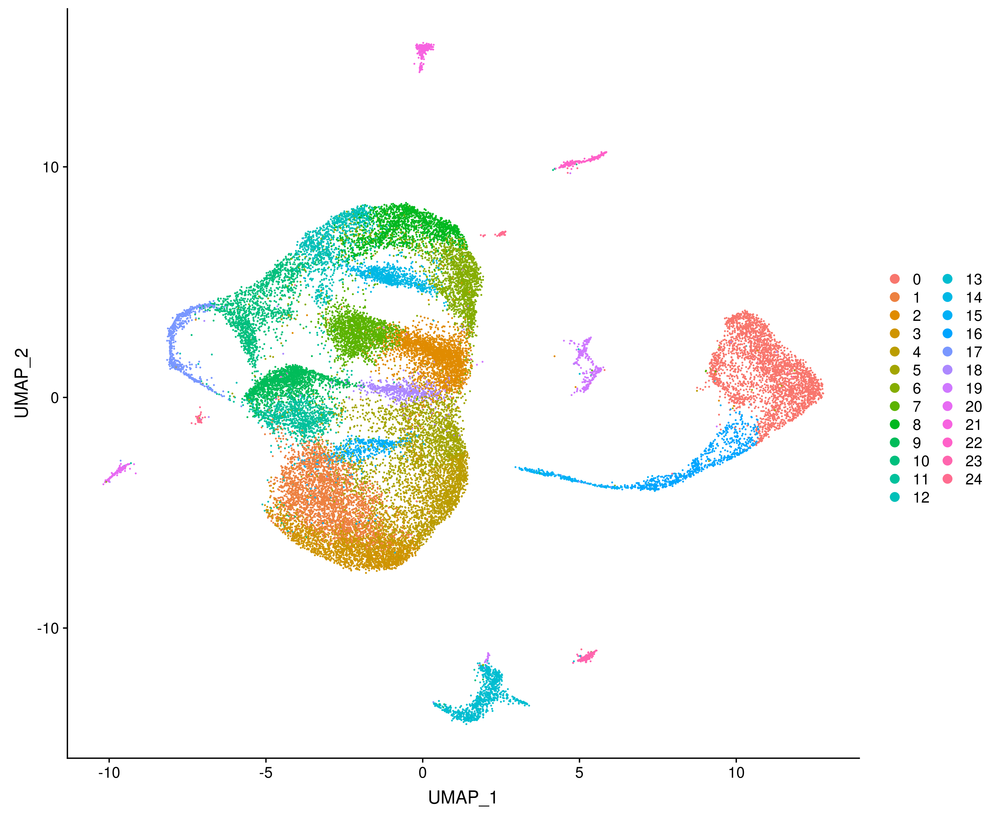

#### Annotations based on PC 25


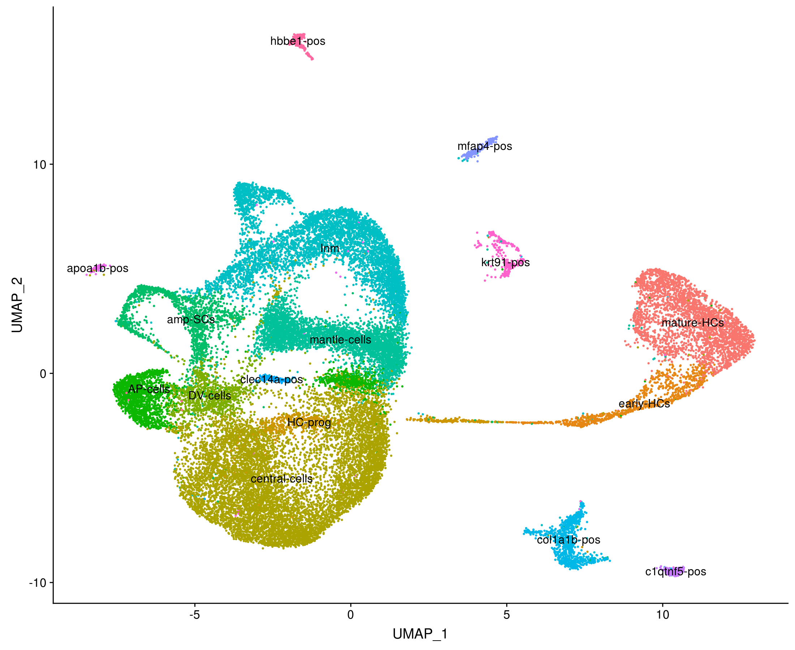

```{r, echo=FALSE}
obj_integrated <- readRDS("../data/homeo_samples_integ.RDS")
table(obj_integrated$data.set)
table(Idents(obj_integrated), obj_integrated$data.set)

```

## Week May 4th - Integration of Homeostatic Samples and Smartseq2 Sample {.tabset}
This content pertains to integration of smartseq2 and 4 homeostatic samples

#### Clustering based on datasets (PC 15, 20 ,25, 30)

 


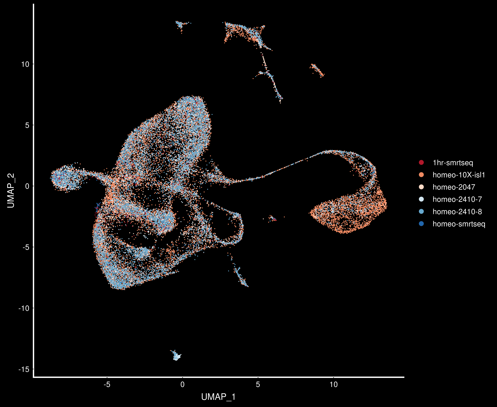

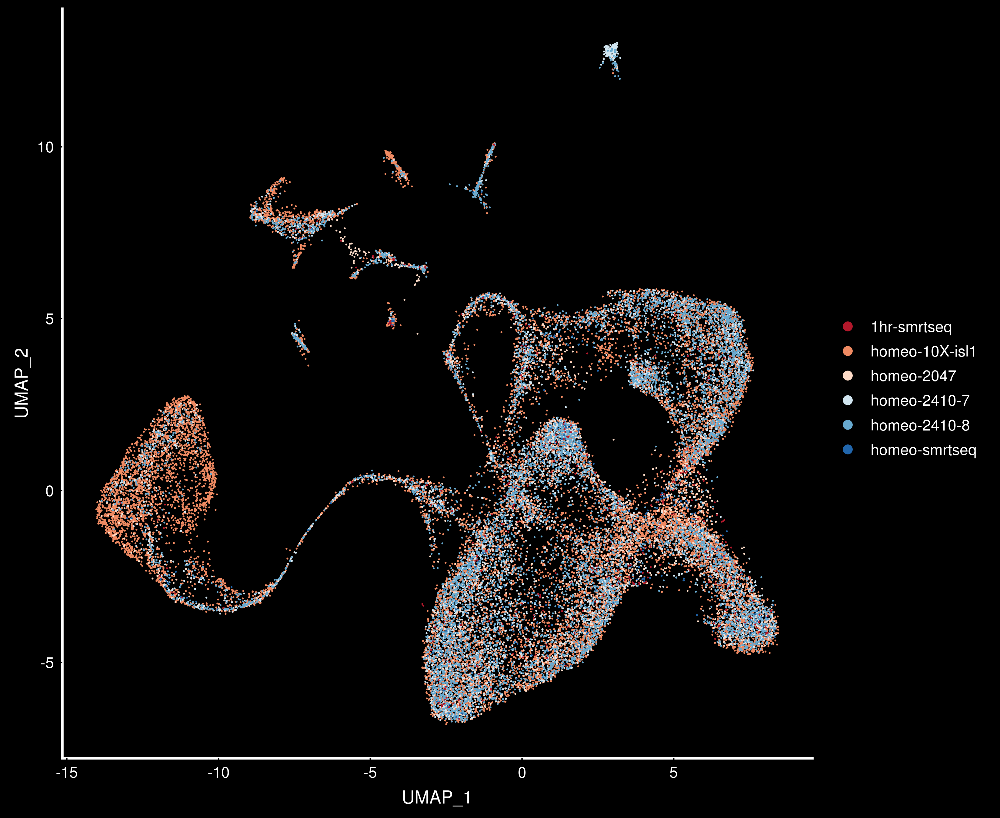


#### Unannotated Umap Clustering (PC 15, 20 ,25, 30)

 


#### Annotations based on PC 25


```{r, echo=FALSE}
obj_integrated_fpkm <- readRDS("../data/adj_fpkm_1828_smartseq_integ.RDS")
table(obj_integrated_fpkm$data.set)
table(Idents(obj_integrated_fpkm), obj_integrated_fpkm$data.set)
```

## Week of May 11th - Filtering out non-specific clusters {.tabset}

content

## Week of May 11th - Differential Gene Expression b/t 1hr and Homeo Treatment {.tabset}

content

### Smartseq2 dataset {.tabset}

content

### Sungmin's Regen App (10X) {.tabset}

content

# {-}


 